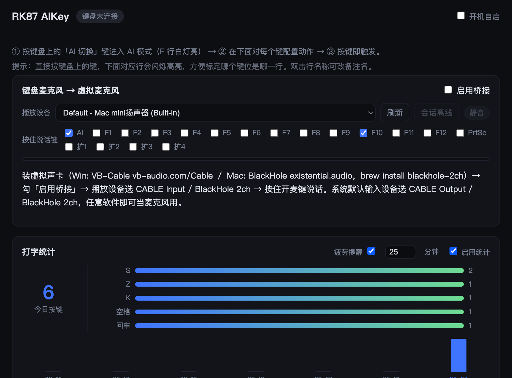

# AnyKey AI

<div align="center">

**把你的键盘变成 AI 控制台——任意键盘，免费，开源**

按住 `Ctrl+Alt` + `F1~F12`，一键唤起 Claude / ChatGPT / 语音输入，你的任何键盘都行。
对 RK R87 Pro AI 键盘额外提供完整深度适配（AI 功能键 + 麦克风桥接）。

不装官方 RK-AI，无广告、无联网上传、纯本地运行

[](https://github.com/xiaoyuyu6420/anykey-ai/releases)
[](https://github.com/xiaoyuyu6420/anykey-ai/releases)
[](LICENSE)
[](https://github.com/xiaoyuyu6420/anykey-ai/discussions)



*AI 层 · 功能键映射 · 键盘麦克风桥接 · 打字统计，一个托盘应用全搞定*

</div>

> **English**: Turn any keyboard into an AI console — Ctrl+Alt+F1~F12 becomes 12 programmable AI hotkeys (launch Claude, ChatGPT, voice dictation…). Plus full deep support for the RK R87 Pro AI keyboard: remap its 14 AI-mode keys and turn its built-in mic into a system microphone. Fully offline.

## ✨ 它能做什么

| 功能 | 一句话说明 |
|---|---|
| 🤖 **AI 层（任意键盘）** | 按住 `Ctrl+Alt` 再按 F1~F12 = 12 个可自定义的 AI 快捷键：打开 Claude/ChatGPT、语音输入、截图、启动任何程序。**不占用 F 键原功能**——不启用时 F 键 100% 原样 |
| ⌨️ **RK 键盘深度适配** | R87 Pro AI 的 AI 键 + F1~F12 + PrtSc 共 14 个键，映射成启动程序 / 网址 / 快捷键，支持「启动后补发快捷键」一键唤起 AI 助手 |
| 🎙️ **键盘麦克风共享**（RK 键盘） | 把键盘内置麦克风变成系统虚拟麦克风——微信输入法、会议软件等**任何应用**都能用它说话 |
| 📊 **打字统计** | 每日按键数、键位热力图、轴体寿命（独立文件持久化）。纯本地记录，只记次数不记内容 |

灵感与定位：OpenAI 的 Codex Micro 桌面控制台卖 $230 还一板难求——AnyKey AI 免费把你**已有的键盘**变成同款 AI 控制台。

## 📦 下载安装（1 分钟）

去 [**Releases**](https://github.com/xiaoyuyu6420/anykey-ai/releases/latest) 下载对应系统的文件：

| 系统 | 文件 | 说明 |
|---|---|---|
| Windows | `AnyKey-AI-x.x.x-portable.exe` | **推荐**，免安装双击即用，配置随 exe 目录（可放 U 盘） |
| Windows | `AnyKey-AI-Setup-x.x.x.exe` | 安装版，开机自启更方便 |
| macOS (M 系列) | `AnyKey.AI-x.x.x-arm64.dmg` | Apple Silicon |
| macOS (Intel) | `AnyKey.AI-x.x.x.dmg` | x64 |

> 从 v0.11.x（RK87 AIKey）升级：直接安装即可，配置与统计数据**自动迁移**。旧版下载仍可通过原地址访问（GitHub 自动重定向）。

> 应用未做代码签名，首次打开如遇 SmartScreen / Gatekeeper 拦截：Windows 点「仍要运行」；macOS 到「系统设置 → 隐私与安全性」点「仍要打开」。介意的话可以自行从源码构建（见文末）。

## 🚀 30 秒上手 AI 层（不需要特定键盘）

1. 打开设置，找到「**AI 层**」卡片，勾选**启用**
2. 点「**Coding 预设**」一键填入：F1 Claude · F2 ChatGPT · F3 Gemini · F4 系统语音输入（Win+H）· F5 截图 · F6 记事本
3. 任意应用里按 **`Ctrl+Alt+F1`**——Claude 打开了。每个格子都能改成启动程序 / 网址 / 快捷键 / AI 直达

设计原则（微软 Copilot 键抢 Right Ctrl 被骂两年的教训）：

- **默认关闭**：不启用就完全不注册热键，F1~F12 保持原样
- **系统级拦截**：启用后触发键组合被 Windows 拦截，不会串进当前应用
- **不碰危险键**：进阶 Alt 方案自动跳过 F4（Alt+F4 永远留给系统）

## ⌨️ RK R87 Pro AI 完整模式

插上 R87 Pro AI 自动进入深度适配（协议逆向自官方 RK-AI 1.0.2 + 三轮实机标定，完整文档见 [docs/protocol.md](docs/protocol.md)）：

1. 启动后托盘常驻，按键盘 **「AI 切换」键**进入 AI 模式（F 行白灯亮）
2. 在设置界面对每个键配动作，**按键即触发**，界面里按键会高亮对应行
3. 「键盘麦克风 → 虚拟麦克风」：装虚拟声卡（Win: [VB-Cable](https://vb-audio.com/Cable/) / Mac: [BlackHole 2ch](https://existential.audio/blackhole/)）→ 勾「启用桥接」→ 按住开麦键（默认 F10）说话，任何软件都能用

支持有线（`VID 248A / PID 8102`）、蓝牙（`PID 8243`）、2.4G 接收器三种连接，即插即用，多口并存自动轮询握手 + 链路劣化自愈。

<details>
<summary><b>键位表（实测标定）</b></summary>

| 物理键 | 键码(按/抬) | 官方原功能 |
|---|---|---|
| AI 键 | 51 / 66 | AI问答 |
| F1 | 82 / 97 | 文字校对 |
| F2 | 58 / 73 | 阅读 |
| F3 | 55 / 70 | 写作 |
| F4 | 63 / 78 | 长文写作 |
| F5 | 60 / 75 | 心得体会 |
| F6 | 59 / 74 | PPT |
| F7 | 53 / 68 | 绘图 |
| F8 | 54 / 69 | 表格 |
| F9 | 83 / 98 | 项目方案 |
| F10 | 48 / 57 | 语音打字（= 默认开麦键） |
| F11 | 49 / 64 | 翻译 |
| F12 | 50 / 65 | 截图 |
| PrtSc | 56 / 71 | 思维导图 |

</details>

## 🎯 动作类型（AI 层与 RK 键位通用）

- **启动程序**：`.exe/.bat/.cmd/.lnk`（macOS 为 `.app/.command`；要带参数就包一层 .bat/.command）
- **打开网址**：http/https 链接
- **发送快捷键**：如 `Ctrl+Shift+S`、`Win+Shift+S`，支持点击「捕获」直接按组合键录入
- **AI 直达**：启动程序/网址 + 延时补发快捷键，一键唤起 AI 助手并聚焦输入框
- **宏**：录制多步按键序列回放（RK 键位模式）

## 📊 打字统计

今日按键总数、键位热力图（3D 键盘点亮图）、Top5、近 7 天柱状图、轴体寿命（`lifetime.json` 独立持久化，升级不丢）。

- 轮询系统级键状态（`GetAsyncKeyState` / `CGEventSourceKeyState`），**不装键盘钩子、不读键盘 HID**
- **隐私**：只记「每键计数」，不记录按键顺序、时间序列或所在应用，不上传任何数据
- 键盘未连接时自动暂停计数（远控/副键盘打字不串数据）；Linux 暂不支持

## ❓ FAQ

<details>
<summary><b>AI 层会干扰 F 键正常使用吗？</b></summary>

不会。默认**不启用 = 不注册任何系统热键**，F 键 100% 原样。启用后只有「触发键+F 键」组合被拦截（如 Ctrl+Alt+F5），单独按 F5 刷新、Alt+F4 关窗完全不受影响。
</details>

<details>
<summary><b>杀毒软件报毒 / SmartScreen 拦截？</b></summary>

应用未购买代码签名证书，属于常见误报。全部源码开放，可自行审查或从源码构建；也可在杀软中添加信任。
</details>

<details>
<summary><b>和官方 RK-AI 软件冲突吗？</b></summary>

完全不依赖官方软件，建议不要同时运行，避免争抢键盘 HID 会话。应用托盘里也有一键退出官方 RK-AI。
</details>

<details>
<summary><b>麦克风桥接后其他软件听不到声音？</b></summary>

按顺序检查：① 虚拟声卡已安装（Windows 装完 VB-Cable 建议重启）；② 系统**默认输入设备**是 `CABLE Output`（不是 CABLE Input）；③ 应用里「启用桥接」已勾选且播放设备是 `CABLE Input`；④ 按住了开麦键（默认 F10）。
</details>

<details>
<summary><b>我的键盘不是 R87 Pro AI，能用吗？</b></summary>

能——这正是 AI 层的用途：任何键盘都能把 F 键区变成 AI 快捷键。RK 系列同方案键盘的深度适配也欢迎提 Issue 一起调试（协议文档见 [docs/protocol.md](docs/protocol.md)）。
</details>

## 💬 反馈

我们正在收集真实使用反馈来决定下一步方向——好用在哪、哪里难用、还想要什么，[去这里说一句](https://github.com/xiaoyuyu6420/anykey-ai/discussions/13)就行，吐槽最有价值。

- 🐛 [报 Bug](https://github.com/xiaoyuyu6420/anykey-ai/issues/new?template=bug_report.yml)
- 💬 [使用反馈 / 提问](https://github.com/xiaoyuyu6420/anykey-ai/discussions)

## 🛠️ 从源码运行

```bash
pnpm install
pnpm start        # 开发运行
pnpm dev          # 开发运行（独立 userData，不污染正式配置）
pnpm listen       # 键盘报文监听标定工具（纯 Node）
pnpm dist         # 打包 Windows portable exe + Setup
pnpm dist:mac     # 打包 macOS zip/dmg（arm64 + x64，未签名）
pnpm test         # 全量单元测试
```

配置存储：Windows `%APPDATA%/AnyKey AI/`（从 v0.11.x `%APPDATA%/RK87 AIKey/` 自动迁移），macOS `~/Library/Application Support/AnyKey AI/`。

目录要点：

- `src/main/ailayer.js` — AI 层：系统热键 → 动作槽位（worker 线程消息循环）
- `src/main/kb-session.js` — RK 键盘命令会话（蓝牙/2.4G 口心跳/验证/开麦）
- `src/main/mic.js` — 音频解码管线（vendor mi-sbc + AGC/高通/噪声门）
- `src/main/stats.js` — 打字统计（系统级键状态轮询 + 本地计数）
- `vendor/mi-hid/` `vendor/mi-sbc/` — 官方库 vendor（HID 驱动 / 音频解码）
- `docs/protocol.md` — RK 键盘完整协议逆向文档

## 🗺️ 已知限制 / 计划

- [x] AI 层（任意键盘 F 键区 → AI 快捷键，Windows）
- [ ] AI 层 macOS 版（CGEvent 热键方案）
- [x] macOS 兼容：CGEvent 快捷键、mi-hid/mi-sbc darwin prebuilds、构建配置已就绪；首次使用需在「系统设置 → 隐私与安全性 → 辅助功能」授权本应用
- [x] 2.4G 接收器 / 有线 USB 完整支持：三种连接方式功能等价（2026-08 实机标定）
- [ ] 官方软件的语音打字/翻译云服务是闭源的，本工具只做「麦克风」，识别交给第三方输入法
- [ ] RK 键盘改键（协议已定位，未实现）
- [ ] 音质上限受源头 32kbps 编码限制，后处理只能拉响度不能补细节

## ⭐ 支持

如果这个工具帮到了你，点个 Star 让更多人看到；也欢迎[提反馈](https://github.com/xiaoyuyu6420/anykey-ai/discussions/13)和 PR。

## 📄 免责声明

仅供个人学习与研究使用。RK 键盘通信协议通过分析本机已安装的官方 RK-AI 软件明文代码获得；`vendor/` 中的 mi-hid、mi-sbc 库提取自官方发行包，版权归原作者所有。与官方 RK-R 论坛/固件无关联，使用本工具产生的一切后果由使用者自行承担。
